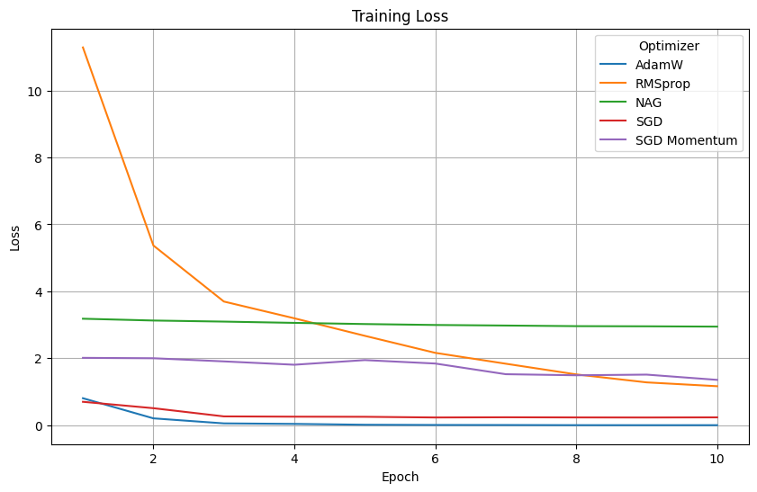
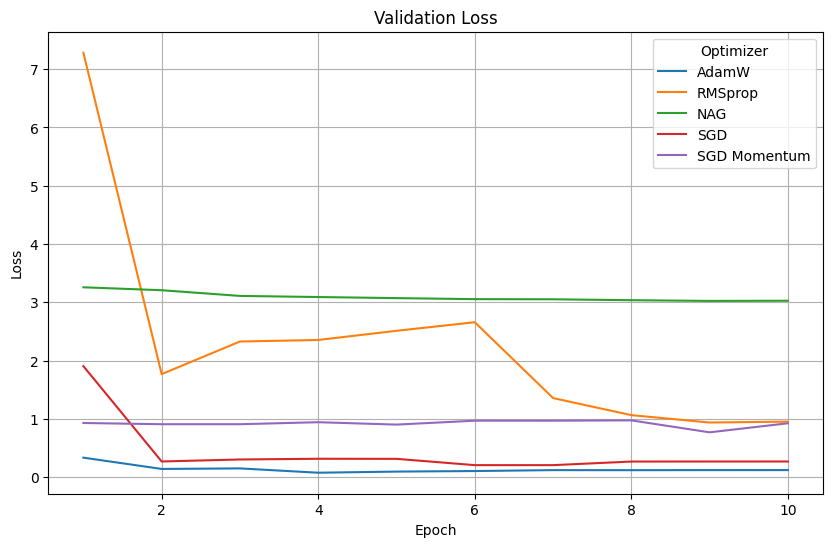

# Financial News Headline Sentiment Analysis

Welcome to the Financial News Headline Sentiment Analysis project repository. Here, we employ advanced machine learning and deep learning techniques to classify financial news headlines into sentiment categories: positive, neutral, or negative.

## Dataset

We leverage the Financial Phrase Bank dataset, a collection of financial news headlines annotated with sentiment labels. This dataset, widely acknowledged in the finance domain, comprises 2,264 headlines, providing a robust foundation for sentiment analysis and text classification tasks.

The dataset contains 2,264 news headlines labeled with sentiment categories: positive, neutral, and negative.

You can access the dataset [here](https://huggingface.co/datasets/financial_phrasebank).

## Traditional Machine Learning Algorithms

In our exploration of traditional machine learning algorithms, we observed the following: 

- Utilizing TF-IDF tokenization significantly enhanced accuracy of most algorithms compared to bag of words representation, indicating TF-IDF's efficacy in capturing term importance.
- Logistic Regression, Gradient Descent, and Random Forest performed reasonably well with both BOW and TF-IDF tokenization, achieving accuracy rates ranging from 77% to 87%.
- Naive Bayes also achieved good accuracy with BOW, but its performance remained consistent with TF-IDF tokenization.
- Notably, Support Vector Machine (SVM) demonstrated substantial accuracy improvement with TF-IDF, highlighting the importance of term weighting for SVM classification.

| Model               | Bag Of Words | TF-IDF     |
|---------------------|--------------|------------|
| Logistic Regression | 80%          | 87%        |
| Random Forest       | 77%          | 86%        |
| SVM                 | 72%          | 85%        |
| Gradient Descent    | 79%          | 87%        |
| Naive Bayes         | 82%          | 82%        |

## Deep Learning Models

**LSTM Model Training:**

The LSTM model was trained over 10 epochs using the Adam optimizer. During training, the loss function used was categorical cross-entropy, and the metric used to monitor performance was accuracy.

- Training Loss: Decreased from 0.9651 to 0.0506
- Training Accuracy: Increased from 60.36% to 98.20%
- Test Accuracy: Attained 84.77%

## BERT Models

Incorporating BERT-based models, including FinBERT, we achieved remarkable performance metrics:

| Model              | Accuracy | F1 Score |
|--------------------|----------|----------|
| BERT Base          | 90%      | 0.90     |
| DistilBERT         | 95.80%   | 0.95     |
| FinBERT            | 96.90%   | 0.97     |

**Training and Validation Loss Analysis:**

Comparing the training and validation loss of the optimizers for the fined-tuned FinBERT model:

- The Adam optimizer exhibited the fastest convergence rate.
- Order of convergence of the optimizers: AdamW > SGD > SGD (Momentum) > NAG > RMSprop.

## Conclusion:

Our experiments demonstrate the effectiveness of diverse machine learning and deep learning algorithms for text classification on the Financial Phrase Bank dataset. BERT-based models, particularly FinBERT, showcased superior performance, achieving high accuracy and F1 scores compared to traditional machine learning approaches.
